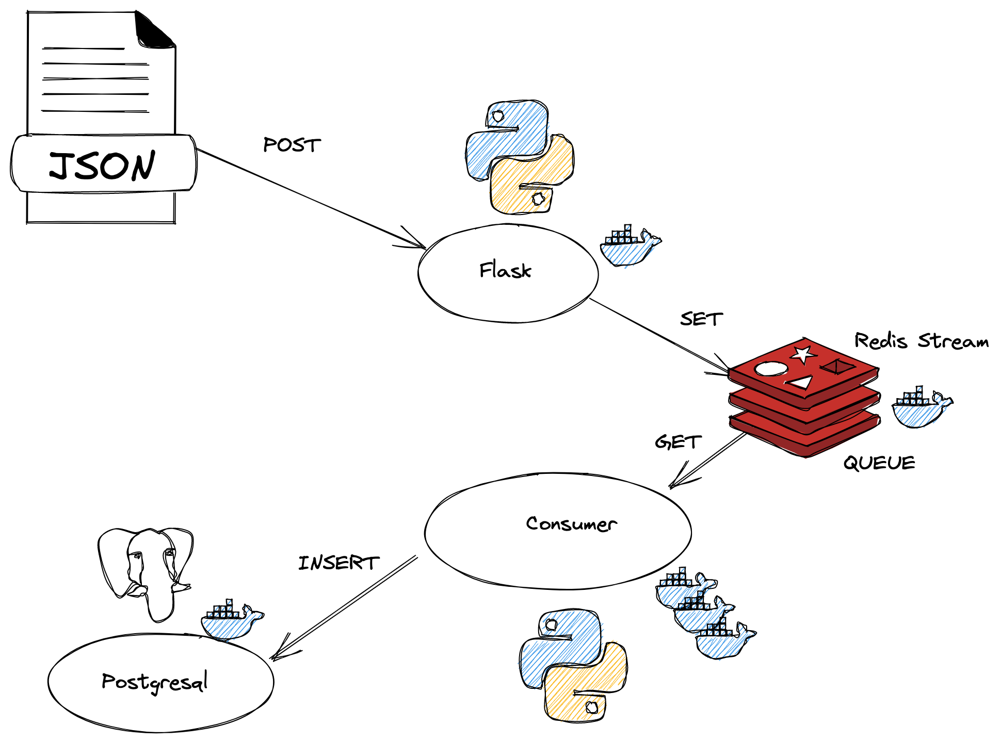
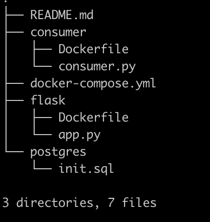

# docker-redis-flask-postgres

- HTTP - REST API servisine gelen istekler Flask ile REDİS QUEUE’a gönderilir. Gelen veri bir bir JSON veya JSON Array olabilir. Testler 20000 elemanlı bir JSON Array isteği ile yapılmıştır.
- Redis queue’da bekleyen datalar consumer sayısına göre dağıtılır. Hangi datanın hangi consumer’a verildiği Redis’’in sorumluluğudur ve son verilen datayı kendisi takip ederek data tekrarını engeller.
- Her consumer, queue’a sıradaki data için istek atar ve aldığı datayı Postgresql veritabanına yazar.

Dizin yapsısı

Çalıştırmak için

`git clone https://github.com/t3k3/docker-redis-flask-postgres.git`

`docker-compose up`

`127.0.0.1:5000` adresine POST metoduyla JSON data gönderiniz.

- Dosyalar arasında Postman için export edilmiş `pexam.postman_collection.json` dosyası import ederek kullanılabilir.